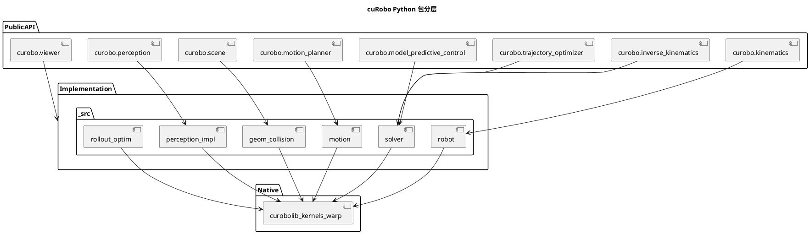

<!-- SPDX-FileCopyrightText: Copyright (c) 2023-2026 NVIDIA CORPORATION & AFFILIATES. All rights reserved. -->
<!-- SPDX-License-Identifier: Apache-2.0 -->

# 02 — 软件架构：从公开 API 到 CUDA/Warp

## 分层模型

cuRobo 的安装包名为 `nvidia-curobo`（见根目录 [pyproject.toml](https://github.com/NVlabs/curobo/blob/main/pyproject.toml)）。Python 包根为 `curobo/`，对学习者最重要的是三层：

1. **公开 API（稳定入口）**：`curobo/*.py` 中的薄模块，如 `kinematics.py`、`inverse_kinematics.py`、`trajectory_optimizer.py`、`motion_planner.py`、`model_predictive_control.py`、`scene.py`、`perception.py`、`viewer.py` 等。快速导入列表见 [curobo/__init__.py](https://github.com/NVlabs/curobo/blob/main/curobo/__init__.py) 的文档字符串。
2. **实现层**：`curobo/_src/` — 按领域分子包（`robot/`、`solver/`、`motion/`、`geom/`、`collision/`、`perception/`、`rollout/`、`optim/`、`curobolib/`、`types/`、`util/` 等）。阅读源码时**从此处下钻**。
3. **原生加速**：`curobo/_src/curobolib/` — CUDA 内核、Warp、`cuda.core` 后端等；`pyproject.toml` 中 `[tool.setuptools.package-data]` 声明了 `.cu`/`.cuh` 等资源随包分发。

## 配置与资源

- **机器人 / 任务 / 场景 YAML**：随包数据在 [curobo/content/configs/](https://github.com/NVlabs/curobo/tree/main/curobo/content/configs) 下，常见子目录包括 `robot/`、`task/`（如 `ik/`、`trajopt/`、`mpc/`、`graph_planner/` 等）、`scene/`。
- **解析与 I/O**：`curobo.config_io` → `curobo._src.util.config_io`（`load_yaml`、`resolve_config` 等）。
- **从 URDF 生成配置**：`curobo.robot_builder`、`curobo.robot_parser` 对应 `_src/robot/builder`、`parser`、`loader`。

典型模式（各公开模块文档中均有）：`*Cfg.from_robot_yaml_file(...)` 或 `*Cfg.create(robot="franka.yml", ...)`。

## 类型系统

`curobo.types` 提供 `JointState`、`Pose` 等与 GPU 张量布局一致的核心类型；各求解器接口在公开模块的 docstring 与 Sphinx API 中有说明。

## 扩展点：自定义代价与优化

- 文档：[Guides](https://github.com/NVlabs/curobo/tree/main/docs/guides) — 例如 [custom optimization](https://github.com/NVlabs/curobo/blob/main/docs/guides/custom_optimization.rst)。
- 示例脚本：[custom_optimization.py](https://github.com/NVlabs/curobo/blob/main/curobo/examples/guides/custom_optimization.py)（模块 `curobo.examples.guides.custom_optimization`）。

## 与 Sphinx 文档构建

官方站点由 [docs/conf.py](https://github.com/NVlabs/curobo/blob/main/docs/conf.py) 构建；`sphinx-apidoc` 生成的 API 在 `docs/api/`。学习型 README **不**自动进入 Sphinx toctree；若需收录，可在 `docs/index.rst` 中另行添加链接（本任务默认不改 Sphinx 入口）。

## 延伸阅读

- [CH01_algorithm_design.md](CH01_algorithm_design.md)
- [Optimization solvers](https://github.com/NVlabs/curobo/blob/main/docs/concepts/optimization_solver.rst)
- [Runtime / reference](https://github.com/NVlabs/curobo/tree/main/docs/reference)

## PlantUML 渲染说明

见 [CH00_INDEX.md](CH00_INDEX.md#plantuml-rendering)。

## 本篇术语释义

| 术语 | 含义 |
|------|------|
| **公开 API（稳定入口）** | 用户主要导入的 `curobo` 顶层模块（如 `kinematics`、`motion_planner`）；接口相对稳定，文档以这里为准。 |
| **薄封装 / thin wrapper** | 顶层 `.py` 少量代码，把配置与类型转发到 `_src` 内实现，便于保持用户导入路径清晰。 |
| **`curobo._src`** | 库的内部实现包；版本迭代时可能有重构，学习源码时从此下钻。 |
| **`curobolib`** | 承载 CUDA 内核、Warp 与 `cuda.core` 等原生后端的子树；与 Python 逻辑通过绑定/调用衔接。 |
| **Warp** | NVIDIA 的 Python 可微 GPU 内核/图形语言；cuRobo 中部分几何与感知核依赖 `warp-lang`。 |
| **CUDA** | NVIDIA GPU 通用并行计算平台；碰撞、距离场等与 GPU 绑定的计算多经此路径加速。 |
| **`package-data` / 包数据** | setuptools 声明的随轮分发非 `.py` 资源（如 `.cu`/`.cuh`）；安装后仍位于包内路径供运行时编译或加载。 |
| **YAML 配置** | 人类可读的配置格式；机器人、任务、场景参数常以 `.yml` 存放在 `curobo/content/configs/`。 |
| **`*Cfg` 类** | 各功能模块的配置对象（如 `MotionPlannerCfg`），通常提供 `from_robot_yaml_file` / `create` 等工厂方法。 |
| **`curobo.types`** | 关节状态、位姿等与张量布局一致的核心数据类型，在 API 间传递以保证形状与坐标系约定。 |
| **`config_io`** | 解析、合并、解析路径引用等配置加载辅助模块，减少手写路径错误。 |
| **URDF / robot_builder** | 机器人链路描述格式；`robot_builder` / `robot_parser` 用于从 URDF 等生成 cuRobo 可用的 YAML 或中间表示。 |
| **Sphinx / `sphinx-apidoc`** | 文档工具链；从 Python docstring 生成 API 参考页（本仓库 `docs/api/`）。 |
| **Optional extra** | `pyproject.toml` 中可选依赖组（如 `usd`）；按需安装以减少默认环境体积。 |
