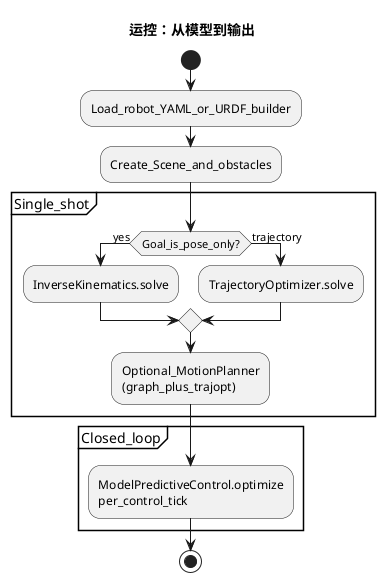
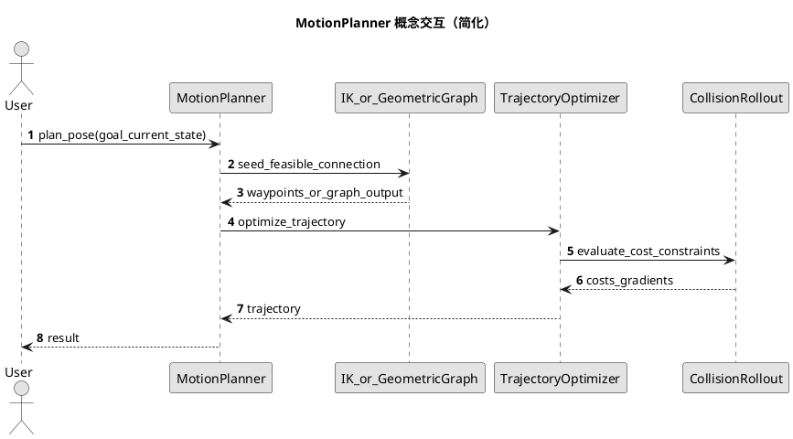

<!-- SPDX-FileCopyrightText: Copyright (c) 2023-2026 NVIDIA CORPORATION & AFFILIATES. All rights reserved. -->
<!-- SPDX-License-Identifier: Apache-2.0 -->

# 04 — 运控管线：从状态到轨迹与控制

> **与 README_06 的分工**：本文以 **公开 API 表、示例路径与 PlantUML 管线图** 为主。若你希望从 **关节变量、Jacobian、代价函数、Rollout** 等一步步推到同一套 API，请读 [README_06 — 运控计算方法初学者导读](CH06_motion_control_computational_walkthrough.md)。

## 目标

把 **关节状态 / 末端目标** 转为 **无碰撞、满足约束** 的关节轨迹或控制序列：前向运动学与世界建模、碰撞距离、IK、单次轨迹优化、图搜索 + 优化的运动规划，以及 **MPC** 闭环。

## 公开 API 主线

| 步骤 | 模块 | 典型类 / 函数 |
|------|------|----------------|
| 机器人模型与 FK | `curobo.kinematics` | `Kinematics`, `KinematicsCfg` |
| 场景与障碍 | `curobo.scene` | `Scene`, `Cuboid`, `Sphere`, `Mesh` |
| 碰撞查询（自定义管线） | `curobo.collision_checking` | 按 docstring 使用 |
| 逆运动学 | `curobo.inverse_kinematics` | `InverseKinematics`, `InverseKinematicsCfg` |
| 轨迹优化 | `curobo.trajectory_optimizer` | `TrajectoryOptimizer`, `TrajectoryOptimizerCfg` |
| 运动规划（组合能力） | `curobo.motion_planner` | `MotionPlanner`, `MotionPlannerCfg` |
| 批量运动规划 | `curobo.batch_motion_planner` | `BatchMotionPlanner`（多问题并行） |
| 模型预测控制 | `curobo.model_predictive_control` | `ModelPredictiveControl`, `ModelPredictiveControlCfg` |
| 运动重定向 | `curobo.motion_retargeter` | 见模块说明 |

实现主要分布在 `curobo._src.robot`、`solver`、`motion`、`collision`、`geom` 等（见 [CH02_software_design.md](CH02_software_design.md)）。

## 官方示例（仓库内真实路径）

| 能力 | 运行模块 | 源文件 |
|------|----------|--------|
| FK | `curobo.examples.getting_started.forward_kinematics` | [forward_kinematics.py](https://github.com/NVlabs/curobo/blob/main/curobo/examples/getting_started/forward_kinematics.py) |
| IK | `curobo.examples.getting_started.inverse_kinematics` | [inverse_kinematics.py](https://github.com/NVlabs/curobo/blob/main/curobo/examples/getting_started/inverse_kinematics.py) |
| 运动规划 | `curobo.examples.getting_started.motion_planning` | [motion_planning.py](https://github.com/NVlabs/curobo/blob/main/curobo/examples/getting_started/motion_planning.py) |
| MPC | `curobo.examples.getting_started.reactive_control` | [reactive_control.py](https://github.com/NVlabs/curobo/blob/main/curobo/examples/getting_started/reactive_control.py) |
| 人形 + MPC/重定向相关 | `curobo.examples.getting_started.humanoid_retargeting` | [humanoid_retargeting.py](https://github.com/NVlabs/curobo/blob/main/curobo/examples/getting_started/humanoid_retargeting.py) |
| 构型生成 | `curobo.examples.getting_started.build_robot_model` | [build_robot_model.py](https://github.com/NVlabs/curobo/blob/main/curobo/examples/getting_started/build_robot_model.py) |

## 运控活动图（PlantUML）

## 运动规划内部概念序列（简化）

> 说明：真实类名与调用顺序以 `curobo._src.motion.motion_planner` 实现与 Sphinx 文档为准；本图用于建立心智模型。

## 延伸阅读

- [CH01_algorithm_design.md](CH01_algorithm_design.md)
- [CH03_perception_pipeline.md](CH03_perception_pipeline.md)
- [Getting started: motion planning](https://github.com/NVlabs/curobo/blob/main/docs/getting-started/motion_planning.rst)
- [Concepts: graph planner](https://github.com/NVlabs/curobo/blob/main/docs/concepts/graph_planner.rst)

## PlantUML 渲染说明

见 [CH00_INDEX.md](CH00_INDEX.md#plantuml-rendering)。

## 本篇术语释义

| 术语 | 含义 |
|------|------|
| **运控** | 运动控制的统称：从状态与目标到可行轨迹或控制指令的整条链路（本库侧重规划侧）。 |
| **`JointState`** | 关节位置（及可选速度等）与张量布局的统一类型；FK、碰撞、IK、MPC 的常用输入。 |
| **FK（Forward kinematics）** | 由关节角计算连杆/末端位姿；用于碰撞体更新与任务空间误差。 |
| **IK（Inverse kinematics）** | 由末端（或多任务）位姿求关节角；可能无解或多解，数值求解常带避障与正则项。 |
| **`Kinematics` / `KinematicsCfg`** | 前向运动学求解器及其配置（如机器人 YAML、链名）。 |
| **`Scene`** | 工作空间中解析障碍的集合（立方体、球、网格等），与体素距离场共同描述碰撞环境。 |
| **`Cuboid` / `Sphere` / `Mesh`** | 场景中表示障碍的常见几何原语；碰撞检测对不同类型有不同加速结构。 |
| **`collision_checking`** | 面向自定义管线暴露的碰撞查询模块；需要更细粒度控制时使用，而非只用高层规划器。 |
| **`TrajectoryOptimizer` / TrajOpt** | 在时间上优化关节轨迹（或等价参数化），使代价小且满足碰撞与限位等约束。 |
| **`MotionPlanner`** | 高层运动规划：常组合几何/图搜索与轨迹优化，输出可行轨迹。 |
| **`MotionPlannerCfg`** | 运动规划器配置；可指定机器人、场景、批大小等。 |
| **`BatchMotionPlanner`** | 在同一调用中并行求解多组独立规划问题，提高吞吐量（如抓取多候选）。 |
| **`ModelPredictiveControl`（MPC）** | 短视域滚动优化控制；适合跟踪动目标与在线避障。 |
| **`motion_retargeter`** | 将一种运动表示（如示教）映射到当前机器人约束下的模块，常与 IK/MPC 组合。 |
| **Single-shot（单次规划）** | 离线或触发式求一整条轨迹再执行；与每周期重算的 MPC 相对。 |
| **Closed-loop（闭环）** | 控制周期内根据最新状态反馈重新求解，抑制模型误差与扰动。 |
| **Waypoint（路点）** | 轨迹或路径上的中间关节/位姿点；图规划输出常作为轨迹优化的初值或约束。 |
| **`CollisionRollout`（概念）** | 序列图中抽象表示「在 rollout 中评估碰撞代价与梯度」；具体类名以实现为准。 |
