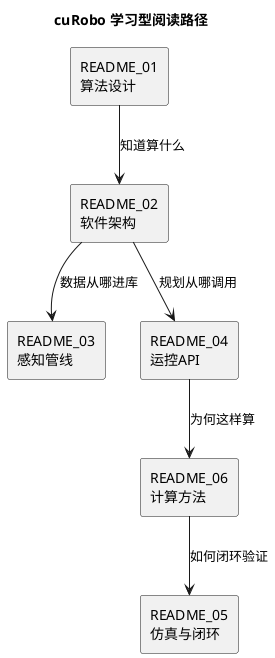

<!-- SPDX-FileCopyrightText: Copyright (c) 2023-2026 NVIDIA CORPORATION & AFFILIATES. All rights reserved. -->
<!-- SPDX-License-Identifier: Apache-2.0 -->

# cuRobo 学习型文档索引

本目录（`docs/study/`）提供与官方 Sphinx 教程互补的**中文学习笔记**：用「一条主线 + PlantUML 图」把算法、软件架构、感知管线、运控管线和仿真/可视化闭环串起来。细节推导与 API 仍以官方文档为准。

**运控双读**：先掌握 API 与数据流见 [README_04](README_04_motion_control_pipeline.md)；要从**数学与优化直觉**分步推导到同一套 API，见 [README_06](README_06_motion_control_computational_walkthrough.md)。

## 推荐阅读顺序

| 顺序 | 文档 | 内容概要 |
|------|------|----------|
| 1 | [README_01_algorithm_design.md](README_01_algorithm_design.md) | 算法脉络：轨迹表示、距离场、IK、图规划、轨迹优化、MPC、动力学约束 |
| 2 | [README_02_software_design.md](README_02_software_design.md) | 软件分层：公开 API、`curobo._src`、Warp/CUDA、配置与类型 |
| 3 | [README_03_perception_pipeline.md](README_03_perception_pipeline.md) | 感知：`FilterDepth`、`Mapper`（TSDF/ESDF）、分割与位姿估计 |
| 4 | [README_04_motion_control_pipeline.md](README_04_motion_control_pipeline.md) | 运控 **API / 管线图**：模块表、示例路径、PlantUML |
| 5 | [README_06_motion_control_computational_walkthrough.md](README_06_motion_control_computational_walkthrough.md) | 运控 **计算方法导读（初学者）**：从 \(q\)、Jacobian、代价到 IK/TrajOpt/MPC 与 API 对应 |
| 6 | [README_05_simulation_visualization_closure.md](README_05_simulation_visualization_closure.md) | 外部仿真闭环、`ViserVisualizer`/`UsdWriter`、示例索引 |

## 与官方文档的关系

- **分步教程（英文）**：[Getting started](../getting-started/index.rst) — 安装、构型、FK、IK、MPC、运动规划、体素建图等。
- **概念深入**：[Concepts](../concepts/index.rst) — Rollout、优化器、几何图规划等。
- **论文与技术报告**：[Technical reports](../technical_reports.rst) — cuRoboV2（[arXiv:2603.05493](https://arxiv.org/abs/2603.05493)）与 cuRobo v1（[arXiv:2310.17274](https://arxiv.org/abs/2310.17274)）。
- **在线站点**：[nvlabs.github.io/curobo](https://nvlabs.github.io/curobo)

## 术语速查（中英对照）

| 中文 | 英文 / cuRobo 概念 |
|------|-------------------|
| 前向运动学 | Forward kinematics，`Kinematics` |
| 逆运动学 | Inverse kinematics，`InverseKinematics` |
| 轨迹优化 | Trajectory optimization，`TrajectoryOptimizer` |
| 模型预测控制 | Model predictive control，`ModelPredictiveControl` |
| 运动规划 | Motion planning，`MotionPlanner` / `BatchMotionPlanner` |
| 有符号距离场 / 欧氏符号距离场 | SDF / ESDF；体素侧与 TSDF 融合见 `Mapper` |
| 场景与障碍 | `Scene`，`Cuboid` / `Sphere` / `Mesh` 等 |
| 展开（代价沿轨迹积分） | Rollout（见 `docs/concepts/rollout_class.rst`） |

## PlantUML 图表如何渲染

各篇 README 中的图表使用 fenced code，语言标记为 `plantuml`。

1. **VS Code**：安装 [PlantUML](https://marketplace.visualstudio.com/items?itemName=jebbs.plantuml) 扩展，配置 Java 与可选 Graphviz，在预览中渲染。
2. **命令行**：下载 [PlantUML](https://plantuml.com/download)，执行  
   `java -jar plantuml.jar -tsvg docs/study/diagrams/*.puml`（若你单独保存了 `.puml` 文件）。
3. **Docker**：`docker run --rm -v "$PWD":/work plantuml/plantuml -tsvg /work/docs/study/...`

> 提示：部分 Markdown 预览器不内嵌 PlantUML，将代码块复制到 `.puml` 文件用上述方式导出 PNG/SVG 即可。

## 官方示例脚本一览（仓库内路径）

运行方式一般为：`python -m curobo.examples.<子包>.<模块>`（在已安装 `nvidia-curobo` 的环境中）。

| 主题 | 模块路径 | 源文件（相对仓库根） |
|------|----------|----------------------|
| 构型 / YAML | `curobo.examples.getting_started.build_robot_model` | `curobo/examples/getting_started/build_robot_model.py` |
| 前向运动学 | `curobo.examples.getting_started.forward_kinematics` | `curobo/examples/getting_started/forward_kinematics.py` |
| 逆运动学 | `curobo.examples.getting_started.inverse_kinematics` | `curobo/examples/getting_started/inverse_kinematics.py` |
| MPC 反应式控制 | `curobo.examples.getting_started.reactive_control` | `curobo/examples/getting_started/reactive_control.py` |
| 运动规划 | `curobo.examples.getting_started.motion_planning` | `curobo/examples/getting_started/motion_planning.py` |
| 体素建图 / ESDF | `curobo.examples.getting_started.volumetric_mapping` | `curobo/examples/getting_started/volumetric_mapping.py` |
| 人形重定向 | `curobo.examples.getting_started.humanoid_retargeting` | `curobo/examples/getting_started/humanoid_retargeting.py` |
| 自定义优化 | `curobo.examples.guides.custom_optimization` | `curobo/examples/guides/custom_optimization.py` |
| 球拟合对比 | `curobo.examples.reference.sphere_fit_comparison` | `curobo/examples/reference/sphere_fit_comparison.py` |
| 机器人位姿标定 | `curobo.examples.reference.robot_pose_calibration` | `curobo/examples/reference/robot_pose_calibration.py` |

## 学习路径总览（PlantUML）



## 本篇术语释义

以下解释**仅本篇索引**中出现的概念；各子篇另有针对性术语表。

| 术语 | 含义 |
|------|------|
| **Sphinx** | Python 常用的文档生成工具；本仓库 `docs/` 下 `.rst` 文件经 Sphinx 编成 HTML 站点。 |
| **Getting started / Concepts** | 官方教程与概念文档入口；前者偏操作步骤，后者偏设计与接口心智模型。 |
| **Technical reports** | 仓库内对 cuRobo v1 / V2 论文与成果的汇总页，用于引用算法出处。 |
| **ArXiv** | 预印本论文库；文内链接指向 PDF 摘要页，便于对照算法细节。 |
| **nvidia-curobo** | PyPI/安装意义上的发行包名（见根目录 `pyproject.toml`），导入时仍使用 `import curobo`。 |
| **`python -m`** | 以「可执行模块」方式运行包内脚本，保证 `sys.path` 与包结构正确；示例形如 `python -m curobo.examples.getting_started.forward_kinematics`。 |
| **SPDX 文件头** | 在文件头用 SPDX 标识版权与许可证（如 Apache-2.0），便于合规与自动化扫描。 |
| **PlantUML** | 用文本描述 UML/框图的领域语言；本目录 README 中的 ```plantuml 代码块可复制到插件或命令行工具渲染。 |
| **Fenced code** | Markdown 中用三个反引号包裹的代码块；语言标记为 `plantuml` 时由支持 PlantUML 的预览器渲染。 |
| **Rollout** | 在 cuRobo 概念文档中指沿时间展开动力学/代价的抽象；详见 `docs/concepts/rollout_class.rst`。 |
| **SDF / ESDF / TSDF** | 符号距离场、欧氏符号距离场、截断符号距离场；在索引表中与感知、建图模块对应，详解见 README_03 / README_01。 |
