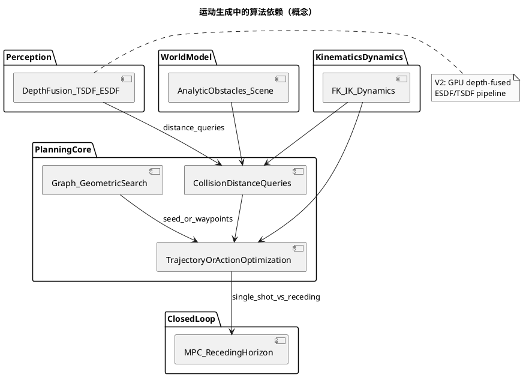
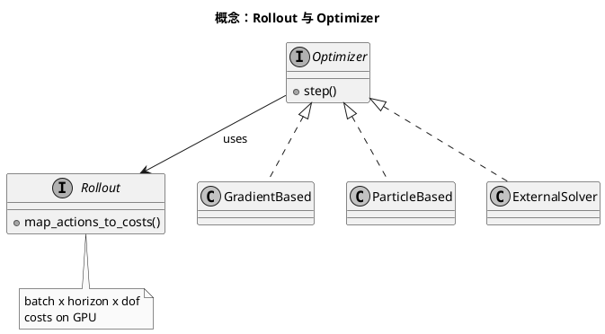

<!-- SPDX-FileCopyrightText: Copyright (c) 2023-2026 NVIDIA CORPORATION & AFFILIATES. All rights reserved. -->
<!-- SPDX-License-Identifier: Apache-2.0 -->

# 01 — 算法设计概览（cuRobo / cuRoboV2）

本文从**问题定义**和**算法族**角度概括 cuRobo 在做什么，并指向官方技术报告与论文；**不重复**公式与证明，避免与上游文档不一致。

## 要解决什么问题

在 GPU 上为机械臂到人形（高自由度）机器人生成**无碰撞、可行、尽量平滑**的运动：包括单点 IK、整条轨迹优化、几何/图搜索与轨迹优化的组合，以及**带动力学约束**的轨迹与 **MPC** 闭环。环境几何既可用解析障碍（立方体、网格等），也可用**深度融合的距离场**做稠密查询。

## cuRoboV2 相对 v1 的算法主线（摘自技术报告表述）

官方 [Technical reports](../technical_reports.rst) 对 V2 的概括包括：

- **动力学感知轨迹优化**：B-spline 轨迹表示 + 可微逆动力学（RNEA）等，用于在优化中考虑**力矩限制**等动力学可行性（详见论文 [arXiv:2603.05493](https://arxiv.org/abs/2603.05493)）。
- **GPU 原生深度融合距离场**：在 GPU 上维护 TSDF/ESDF 类表示，替代对外部 nvblox 的依赖；支持对规划器的 **\(O(1)\)** 风格三线性距离查询（实现与参数见 `Mapper` 与体素教程）。
- **高自由度可扩展性**：统一、类型泛化的 Warp 碰撞核与改进的自碰撞算法，面向全人形（例如约 48 DoF）等规模。

v1 论文 [arXiv:2310.17274](https://arxiv.org/abs/2310.17274) 强调：将无碰撞运动生成表述为**大规模并行优化**，结合 L-BFGS 与并行线搜索、粒子优化器，以及**并行几何规划器**与高速无碰撞 IK。

## 算法模块与直觉

| 主题 | 直觉 | 在 cuRobo 中的典型落点 |
|------|------|------------------------|
| 轨迹表示 | 用少量控制变量表达整条轨迹，便于加平滑与动力学项 | B-spline 等（见 V2 论文与技术报告） |
| 碰撞与距离 | 球体近似连杆 + 与世界/障碍的距离下界 | 几何与碰撞子系统（`geom` / `collision`）、`Scene` |
| 逆运动学 | 给定末端位姿（或多任务），求关节角并避障 | `InverseKinematics` |
| 轨迹优化 | 在 horizon 上最小化代价、满足约束 | `TrajectoryOptimizer`、Rollout + Optimizer（见 [optimization_solver](../concepts/optimization_solver.rst)） |
| 几何 / 图规划 | 在配置空间或工作空间构造可行连接，再衔接优化 | [graph_planner](../concepts/graph_planner.rst)、`MotionPlanner` 内部组合 |
| MPC | 每步重解短 horizon，跟踪动目标或扰动 | `ModelPredictiveControl`（示例：`reactive_control`） |
| 感知建图 | 深度序列 → 体素 TSDF → ESDF，供碰撞查询 | `FilterDepth`、`Mapper`（示例：`volumetric_mapping`） |

## 对应实现入口（软件映射预告）

更细的包结构与调用链见 [README_02_software_design.md](README_02_software_design.md)。算法实现主要分布在 `curobo._src` 下的 `solver/`、`motion/`、`geom/`、`collision/`、`perception/`、`rollout/`、`optim/` 等子包。

## 算法依赖关系（PlantUML）

## 优化求解与 Rollout（必读概念）

cuRobo 将多种求解器统一在 **Rollout**（沿时间展开状态/代价）与 **Optimizer** 协议之上；详见 [Rollout class](../concepts/rollout_class.rst) 与 [Optimization solvers](../concepts/optimization_solver.rst)。

## 延伸阅读

- [Technical reports](../technical_reports.rst)
- [Concepts: graph planner](../concepts/graph_planner.rst)
- [Getting started: motion planning](../getting-started/motion_planning.rst)
- cuRoboV2 论文：<https://arxiv.org/abs/2603.05493>

## PlantUML 渲染说明

见 [README_00_INDEX.md](README_00_INDEX.md#plantuml-图表如何渲染)。

## 本篇术语释义

| 术语 | 含义 |
|------|------|
| **无碰撞运动生成** | 在满足关节与环境约束的前提下，求关节空间轨迹或控制，使连杆与工作空间障碍不发生几何穿透。 |
| **高自由度（高 DoF）** | 关节变量数目多（如全人形数十个关节）；对碰撞与动力学计算提出更高并行与稀疏性要求。 |
| **B-spline（B 样条）** | 用少量控制点光滑参数化整条轨迹；V2 中用于在优化变量紧凑的同时施加平滑与动力学相关项。 |
| **RNEA** | Recursive Newton–Euler Algorithm，递推牛顿–欧拉算法；经典刚体逆动力学，用于由运动求关节力矩。 |
| **力矩限制 / 动力学可行性** | 轨迹不仅几何无碰，还在各关节力矩不超过驱动器能力的前提下可被执行。 |
| **TSDF** | Truncated Signed Distance Function，截断符号距离；多帧深度融合时常用体素 TSDF 表示表面附近距离。 |
| **ESDF** | Euclidean Signed Distance Field，欧氏符号距离场；体素到最近障碍表面的欧氏距离，便于做碰撞裕度与梯度。 |
| **三线性插值（Trilinear）** | 在体素网格八个角点间线性插值，得到连续位置上的标量（如距离）近似，利于优化里可微查询。 |
| **nvblox** | NVIDIA 另一套常用于 ROS2 的实时建图库；V2 技术报告写明部分场景用 GPU 原生管线替代对外部 nvblox 的依赖。 |
| **大规模并行优化** | 在 GPU 上同时展开多组初值或粒子，并行评估代价与梯度，以提高困难 IK/轨迹问题的成功率与速度。 |
| **L-BFGS** | Limited-memory Broyden–Fletcher–Goldfarb–Shanno；近似 Hessian 的拟牛顿法，适合高维平滑优化。 |
| **线搜索（Line search）** | 沿下降方向搜索步长，使代价单调下降或满足 Wolfe 条件等；cuRobo v1 论文强调并行线搜索。 |
| **粒子优化器** | 用粒子群/分布代表候选解，据代价统计更新分布；适合多模态或非凸问题。 |
| **几何 / 图规划器** | 在配置空间或离散图上搜索可行路径或连接，常与连续轨迹优化衔接。 |
| **MPC（模型预测控制）** | 在每个控制周期求解有限时域开环最优控制，只执行首段控制，滚动重复（receding horizon）。 |
| **Horizon（时域）** | MPC 或轨迹优化向前预测的时间步数或长度；越长越保守但计算更重。 |
| **Rollout** | 将控制序列通过动力学/运动学模型向前仿真，得到状态轨迹并累计代价与约束违反。 |
| **Optimizer（优化器）** | 在 cuRobo 中多指实现某迭代策略的对象（梯度类、粒子类、外部 SciPy/torch 等），与 Rollout 组合使用。 |
| **Protocol（协议类型）** | Python typing 中的结构化接口约定；实现类无需继承同一基类，只要具备约定方法即可替换使用。 |
| **单次规划 vs 闭环** | 前者算一条轨迹后执行；后者如 MPC 每步重算，适应扰动与动目标。 |
