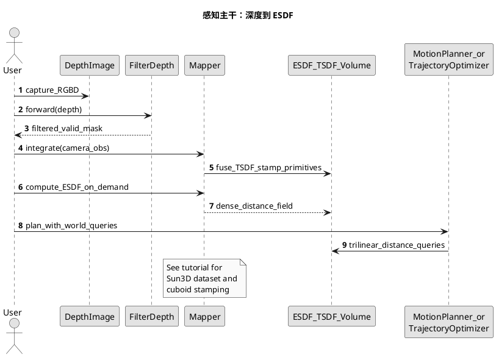
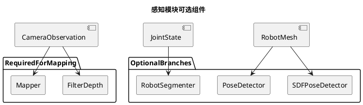

<!-- SPDX-FileCopyrightText: Copyright (c) 2023-2026 NVIDIA CORPORATION & AFFILIATES. All rights reserved. -->
<!-- SPDX-License-Identifier: Apache-2.0 -->

# 03 — 感知管线：深度、体素建图与可选分支

## 目标

从 **RGB-D / 深度** 与已知相机位姿出发，构建可用于碰撞/距离查询的世界模型；并可选地对机器人自身成像进行**分割**或基于网格/SDF 的**位姿检测**。公开入口为 [curobo/perception.py](../../curobo/perception.py)。

## 核心数据流（主干）

1. **深度预处理**：`FilterDepth` 对深度图滤波与有效性掩码，减少噪声与无效读数对融合的影响。
2. **体素融合与距离场**：`Mapper` / `MapperCfg` 将多帧深度融合为 **TSDF** 表示，并按需计算 **ESDF**，供规划器做稠密距离查询。体素教程中描述了 block-sparse 融合、解析几何通道（如立方体）盖章、PBA+ 类 ESDF 计算等（见示例脚本内文档字符串）。
3. **与规划结合**：融合后的距离查询与 `Scene` 中的解析障碍一起，进入碰撞与轨迹优化管线（见 [README_04_motion_control_pipeline.md](README_04_motion_control_pipeline.md)）。

## 可选分支

| 分支 | 用途 | 公开类（节选） |
|------|------|----------------|
| 机器人分割 | 从深度中抠除机器人像素，便于只对环境建图 | `RobotSegmenter` |
| 位姿估计 | 点云/观测对齐到机器人网格 | `PoseDetector`、`SDFPoseDetector` 与对应 `*Cfg` |

实现代码位于 `curobo/_src/perception/`（`filter_depth.py`、`mapper/`、`robot_segmenter.py`、`pose_estimation/` 等）。

## 官方教程与示例

- Sphinx：[Volumetric mapping](../getting-started/volumetric_mapping.rst)
- 示例模块：`python -m curobo.examples.getting_started.volumetric_mapping`
- 源文件：[volumetric_mapping.py](../../curobo/examples/getting_started/volumetric_mapping.py)

## 感知管线序列图（PlantUML）

## 与分割 / 位姿分支的关系（组件图）

## 延伸阅读

- [README_01_algorithm_design.md](README_01_algorithm_design.md)（距离场在算法中的角色）
- [README_02_software_design.md](README_02_software_design.md)（`_src/perception` 位置）
- 公开 API 文档字符串：[perception.py](../../curobo/perception.py)

## PlantUML 渲染说明

见 [README_00_INDEX.md](README_00_INDEX.md#plantuml-图表如何渲染)。

## 本篇术语释义

| 术语 | 含义 |
|------|------|
| **RGB-D** | 同时提供彩色（RGB）与每个像素的深度（D）的传感器或数据对；深度常以米或毫米为单位。 |
| **深度图 / Depth image** | 二维数组，每个像素存储从相机到场景沿视线方向的测距值；噪声、空洞与反射异常是常见误差源。 |
| **`CameraObservation`** | cuRobo 中封装相机观测的类型（如深度、内参、外参/位姿）；作为 `Mapper` 等模块的输入约定。 |
| **`FilterDepth`** | 对原始深度做滤波、有效性判别的模块，输出更干净深度与掩码，减轻融合伪影。 |
| **有效性掩码（valid mask）** | 标记哪些像素深度可信（非 NaN、在合理量程内等），后续融合可跳过无效像素。 |
| **`Mapper` / `MapperCfg`** | 体素建图与距离场生成的主入口及其配置；`MapperCfg` 控制体素尺寸、范围等超参数。 |
| **体素（Voxel）** | 将空间规则划分为小立方体单元；每个单元存储占据或距离等标量/向量。 |
| **TSDF** | 截断符号距离融合：在表面附近保留有符号距离，远处截断为常数，便于多帧加权融合与表面提取。 |
| **ESDF** | 每个体素到最近障碍表面的欧氏距离；规划器可做 \(O(1)\) 风格查询时常配合三线性插值。 |
| **Block-sparse** | 分块存储与更新：仅维护有数据的空域块，降低大场景下显存与带宽开销。 |
| **解析几何通道 / 盖章（stamping）** | 将已知形状（如 `Cuboid`）直接写入体素或距离场通道，与深度融合互补。 |
| **PBA+** | Parallel Banding Algorithm 一类并行带宽算法族；教程中用于在 GPU 上由 TSDF 等构造稠密 ESDF（实现细节见官方文档与源码）。 |
| **三线性查询** | 在 ESDF 体素网格上对八个邻点做三线性插值，得到任意连续位置的近似距离。 |
| **`Scene`（与感知衔接）** | 解析障碍的集合；与体素距离场一起在碰撞查询中描述「世界」。 |
| **`RobotSegmenter`** | 利用几何模型与当前关节角，从深度中分割属于机器人本体的像素，便于对环境单独建图。 |
| **`RobotMesh`** | 机器人外壳网格表示；用于位姿检测等几何对齐。 |
| **`PoseDetector` / `SDFPoseDetector`** | 将观测（如点云）与模型对齐估计位姿；后者借助 SDF 类距离做更鲁棒的几何匹配。 |
| **SDF（此处）** | 有符号距离场或相关距离表示；在位姿分支中可指网格上的符号距离用于 ICP/对齐能量。 |
