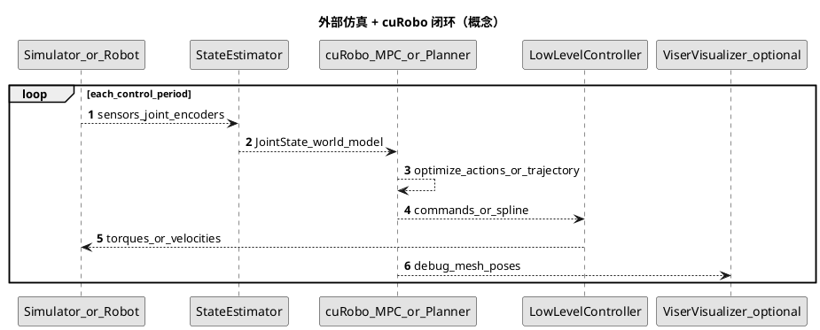

<!-- SPDX-FileCopyrightText: Copyright (c) 2023-2026 NVIDIA CORPORATION & AFFILIATES. All rights reserved. -->
<!-- SPDX-License-Identifier: Apache-2.0 -->

# 05 — 仿真、可视化与闭环集成

## 定位说明（避免误解）

cuRobo **不是**完整的物理仿真器仓库：不包含类似「一键启动 Isaac Sim 场景」的独立仿真应用。工程角色是 **GPU 运动生成库**。所谓「仿真 pipeline」在此理解为：

1. **外部仿真或真机**提供关节状态、传感器、时钟；
2. **cuRobo** 在同一进程或相邻进程中做 IK / 规划 / MPC；
3. 将 **轨迹或低级指令** 回灌到仿真器或控制器；
4. 使用 **Viser / USD** 等做调试可视化或离线回放。

若使用 **Isaac Sim / Omniverse**，通常通过 **USD** 轨迹导出或自建桥接节点完成「看与控」；`UsdWriter` 的说明中提到了与 OpenUSD 兼容查看器及 Isaac Sim 的兼容性（见 [viewer.py](../../curobo/viewer.py) docstring）。

## 可视化：Viser 与 USD

| 组件 | 作用 | 入口 |
|------|------|------|
| `ViserVisualizer` | 浏览器内交互 3D，可调控制框架 | `curobo.viewer`（懒加载 `viser`） |
| `UsdWriter` | 将关节轨迹写到 USD 文件，便于 `usdview` 或 Isaac Sim | `curobo.viewer`（可选依赖 `usd-core`） |

安装提示见 [pyproject.toml](../../pyproject.toml) 的 `usd` optional extra 与 `viewer.py` 中的 `ImportError` 说明。

## 闭环序列图（PlantUML）

## 与学习型文档其它章节的关系

- 世界模型来自 [README_03_perception_pipeline.md](README_03_perception_pipeline.md) 或解析 `Scene`。
- 规划算法见 [README_01_algorithm_design.md](README_01_algorithm_design.md)；模块边界见 [README_02_software_design.md](README_02_software_design.md)。
- 运控 API 见 [README_04_motion_control_pipeline.md](README_04_motion_control_pipeline.md)。

## 仓库内可直接运行的示例（用于「离线闭环心智模型」）

以下脚本不依赖 Isaac Sim，可在配置好 GPU 与依赖的环境中运行，用于理解 **开环规划** 与 **MPC 多步优化**：

| 场景 | 模块 | 源文件 |
|------|------|--------|
| MPC 跟踪 | `curobo.examples.getting_started.reactive_control` | [reactive_control.py](../../curobo/examples/getting_started/reactive_control.py) |
| 运动规划 | `curobo.examples.getting_started.motion_planning` | [motion_planning.py](../../curobo/examples/getting_started/motion_planning.py) |
| 体素 + 规划教程 | `curobo.examples.getting_started.volumetric_mapping` | [volumetric_mapping.py](../../curobo/examples/getting_started/volumetric_mapping.py) |
| 人形示例 | `curobo.examples.getting_started.humanoid_retargeting` | [humanoid_retargeting.py](../../curobo/examples/getting_started/humanoid_retargeting.py) |
| 自定义优化 / 代价 | `curobo.examples.guides.custom_optimization` | [custom_optimization.py](../../curobo/examples/guides/custom_optimization.py) |
| 球拟合 / 几何参考 | `curobo.examples.reference.sphere_fit_comparison` | [sphere_fit_comparison.py](../../curobo/examples/reference/sphere_fit_comparison.py) |
| 位姿标定参考 | `curobo.examples.reference.robot_pose_calibration` | [robot_pose_calibration.py](../../curobo/examples/reference/robot_pose_calibration.py) |

在应用侧接入 **Isaac Sim / MuJoCo / Gazebo** 时，建议自行维护一张「数据类型对照表」：`JointState` 字段、控制周期、坐标系（世界/基座/相机）与 `Scene` 更新频率；本仓库以库 API 为主，不在此固定某一仿真器的 ROS 话题名。

## 延伸阅读

- [Getting started index](../getting-started/index.rst)
- [README_00_INDEX.md](README_00_INDEX.md) 中的示例一览表
- 官方站点：[nvlabs.github.io/curobo](https://nvlabs.github.io/curobo)

## PlantUML 渲染说明

见 [README_00_INDEX.md](README_00_INDEX.md#plantuml-图表如何渲染)。

## 本篇术语释义

| 术语 | 含义 |
|------|------|
| **运动生成库** | cuRobo 定位为可被仿真/真机程序调用的算法库，而非自带完整物理与渲染的一体化仿真应用。 |
| **外部仿真器** | Isaac Sim、MuJoCo、Gazebo 等在 cuRobo 之外的进程或包；负责刚体动力学、传感器与渲染。 |
| **闭环集成** | 仿真器给出状态 → cuRobo 规划 → 低级控制器执行 → 环境更新，形成周期性反馈。 |
| **控制周期 / control tick** | 离散时间控制器调用一次的时间间隔（如 1 ms～数十 ms）；MPC 需在该时限内完成求解。 |
| **状态估计（StateEstimator）** | 将编码器、IMU、视觉等融合为滤波后的关节/基座位姿；规划器通常消费估计状态而非原始传感器。 |
| **低级控制器（Low-level controller）** | 将规划器输出的位置/速度/力矩指令跟踪到电机；cuRobo 一般不替代该层。 |
| **回灌** | 将规划轨迹或首段控制指令写入仿真或硬件接口，使机器人执行。 |
| **`Viser` / `ViserVisualizer`** | 基于 Web 的交互 3D 可视化库；`ViserVisualizer` 为 cuRobo 封装，用于调试关节与坐标系。 |
| **懒加载（lazy import）** | 仅在首次调用可视化时再 `import viser`，避免未安装可选依赖时在 `import curobo` 阶段失败。 |
| **USD / OpenUSD** | Universal Scene Description，场景与动画交换格式；轨迹可写入 `.usd` 供 `usdview` 或 DCC 工具回放。 |
| **`UsdWriter`** | cuRobo 提供的将关节轨迹写入 USD 文件的写入器。 |
| **`usdview`** | OpenUSD 自带的场景查看器，用于快速检查几何与动画曲线。 |
| **Isaac Sim / Omniverse** | NVIDIA 基于 Omniverse 的机器人仿真平台；可通过 USD 与 cuRobo 输出对接。 |
| **数据类型对照表** | 集成时自建的对照：关节名顺序、`JointState` 与仿真 DOF 顺序、长度单位、世界/基座/相机坐标系、场景更新频率等。 |
| **开环规划** | 规划后不根据仿真反馈重算；教程脚本常用于理解算法而非完整闭环。 |
| **离线闭环心智模型** | 在无可视仿真时，用 MPC 多步脚本理解「每步优化—执行首段」的时序逻辑。 |
