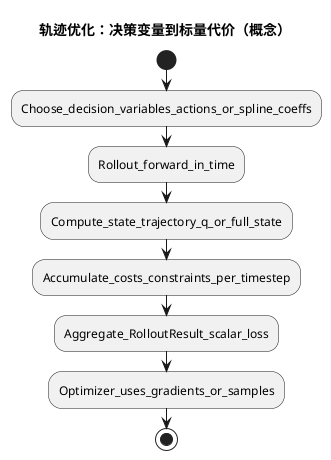
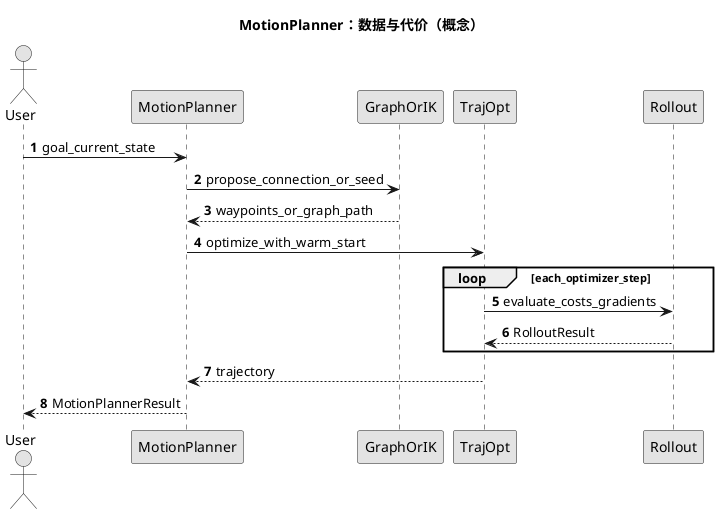

<!-- SPDX-FileCopyrightText: Copyright (c) 2023-2026 NVIDIA CORPORATION & AFFILIATES. All rights reserved. -->
<!-- SPDX-License-Identifier: Apache-2.0 -->

# 06 — 运控「计算方法」初学者导读（从数学骨架到 cuRobo API）

本文与 [README_04 — 运控管线（API 表与图）](README_04_motion_control_pipeline.md) **互补**：这里回答「**为什么**要这样算、代价与约束长什么样」，README_04 回答「**调用哪个类**、数据怎么流」。

**前提**：线性代数（向量、矩阵乘法）、多元函数「梯度」的直觉、Python；未要求凸优化或控制论先修。

**边界**：只给**可实现的直觉公式骨架**；内部权重、完整动力学与 V2 细节见 [Technical reports](../technical_reports.rst) 与论文（[V2](https://arxiv.org/abs/2603.05493)、[V1](https://arxiv.org/abs/2310.17274)）。不臆造 `curobo._src` 中超参数默认值。

---

## 章 0 — 记号与「我们在优化什么」

**直觉**：机器人状态多由关节角向量描述；规划器在找一个**决策变量**（一整段关节轨迹、或 MPC 里的短动作序列），使「又好又安全」。

**数学骨架（简化）**

- 记关节配置为向量 \(q \in \mathbb{R}^{n}\)（\(n\) 为自由度）。离散时间步 \(t=0,\ldots,N\)，轨迹可记为 \(\{q_t\}\) 或在连续时间用少量系数（如 B-spline 控制点，见 V2 技术报告）。
- **单步决策**：MPC 常优化动作序列 \(a_{0:H-1}\)，再通过动力学或运动学模型推出状态序列。
- **horizon**：向前看的时间步数 \(N\) 或 \(H\)；越长越保守但计算更贵。

**cuRobo 落点**

- 类型：`JointState`、`Pose`（[`curobo.types`](../../curobo/types.py)）。
- 软件分层见 [README_02](README_02_software_design.md)。

**动手**

- 构型与关节名：`python -m curobo.examples.getting_started.build_robot_model` — 源码 [`build_robot_model.py`](../../curobo/examples/getting_started/build_robot_model.py)。

---

## 章 1 — 前向运动学与任务误差

**直觉**：已知 \(q\)，末端（或工具）在某坐标系下的位姿 \(x\) 由模型算出；规划常最小化「当前位姿与目标位姿的差别」。

**数学骨架**

- 记前向映射 \(x = f(q)\)（实际实现含链路与外参）。目标 \(x^\*\)，误差 \(e(q)= x^\* - f(q)\)（或 SE(3) 上更合适的对数映射，此处略）。
- **一阶近似**：\(e(q+\delta q) \approx e(q) - J(q)\,\delta q\)，其中 \(J=\partial f/\partial q\) 为 **Jacobian**。IK 与轨迹优化里用 \(J\) 把关节增量映到任务空间。

**cuRobo 落点**

- `Kinematics`、`KinematicsCfg`（[`curobo.kinematics`](../../curobo/kinematics.py)）。

**动手**

- `python -m curobo.examples.getting_started.forward_kinematics` — [`forward_kinematics.py`](../../curobo/examples/getting_started/forward_kinematics.py)。

---

## 章 2 — 场景、距离与碰撞（惩罚/约束的直觉）

**直觉**：除了「到点」，还要离障碍足够远；要么用**硬约束**（距离 \(\ge d_{\mathrm{safe}}\)），要么用**软惩罚**（侵入越深代价越大）。

**数学骨架**

- 对某碰撞对，有 signed / 近似距离 \(d(q)\)（由几何与障碍表示计算）。简单惩罚例：\(\max(0,\, d_{\mathrm{safe}} - d(q))^2\) 加到总代价上。
- 障碍可取解析形状（`Cuboid`、`Sphere`、`Mesh`）或稠密距离场（感知管线中的 ESDF，见 [README_03](README_03_perception_pipeline.md)）。

**cuRobo 落点**

- `Scene` 与几何类型：[`curobo.scene`](../../curobo/scene.py)；自定义碰撞管线 [`curobo.collision_checking`](../../curobo/collision_checking.py)。

**动手**

- 体素 ESDF 与规划结合：`python -m curobo.examples.getting_started.volumetric_mapping` — [`volumetric_mapping.py`](../../curobo/examples/getting_started/volumetric_mapping.py)。

---

## 章 3 — 逆运动学（IK）作为小规模优化

**直觉**：给定末端目标，求 \(q\) 使误差小且关节在限位内、尽量不碰障；往往**无闭式解**，用迭代法解一个非线性最小二乘/约束问题。

**数学骨架（示意）**

\[
\min_{q}\ \|e(q)\|^2 + \lambda \|q-q_{\mathrm{nom}}\|^2 + \text{碰撞惩罚}(q)
\]
s.t. 关节上下界（盒约束）。实际实现还会用阻尼、多种子并行等（见 V1 论文）。

**cuRobo 落点**

- `InverseKinematics`、`InverseKinematicsCfg`（[`curobo.inverse_kinematics`](../../curobo/inverse_kinematics.py)）。

**动手**

- `python -m curobo.examples.getting_started.inverse_kinematics` — [`inverse_kinematics.py`](../../curobo/examples/getting_started/inverse_kinematics.py)。

---

## 章 4 — 轨迹优化（TrajOpt）与 Rollout

**直觉**：不只优化**一个** \(q\)，而是整条离散轨迹 \(\{q_t\}\)（或等价参数），使「跟踪目标 + 光滑 + 不碰 + 不超速」等加权总和最小；需要沿时间**展开**状态并累计代价，才能对**所有时间步的决策变量**求梯度。

**数学骨架（示意）**

\[
\min_{q_{0:N}} \sum_{t=0}^{N} \Big( \ell_{\mathrm{track}}(q_t) + \ell_{\mathrm{smooth}}(q_{t-1},q_t) + \ell_{\mathrm{coll}}(q_t) \Big)
\quad \text{s.t. 动力学/限速等}
\]

**cuRobo 落点**

- `TrajectoryOptimizer`（[`curobo.trajectory_optimizer`](../../curobo/trajectory_optimizer.py)）。
- **Rollout**：动作/系数 → 状态序列 → 代价与约束；见官方 [Rollout classes](../concepts/rollout_class.rst)、[Optimization solvers](../concepts/optimization_solver.rst)。

**动手**

- 自定义代价/优化：`python -m curobo.examples.guides.custom_optimization` — [`custom_optimization.py`](../../curobo/examples/guides/custom_optimization.py)。

### PlantUML：从决策变量到 Rollout 代价（活动图）

---

## 章 5 — `MotionPlanner`：图/几何规划 + TrajOpt

**直觉**：复杂环境里，单纯局部优化易卡在坏初值；先用**图搜索/几何规划**在配置空间找可行通道或稀疏路标，再把结果交给 TrajOpt **磨光**并满足动力学/连续碰撞。

**数学骨架**

- 图规划：在图或采样树上找连接起终的路径；输出一组**路标/短折线**。
- TrajOpt：以路标为初值或约束，优化连续轨迹。

**cuRobo 落点**

- `MotionPlanner`、`MotionPlannerCfg`（[`curobo.motion_planner`](../../curobo/motion_planner.py)）。
- 概念文档：[Graph planner](../concepts/graph_planner.rst)；教程：[Motion planning](../getting-started/motion_planning.rst)。

**动手**

- `python -m curobo.examples.getting_started.motion_planning` — [`motion_planning.py`](../../curobo/examples/getting_started/motion_planning.py)。

### PlantUML：变量与消息（简化序列图）

---

## 章 6 — MPC：滚动时域与「每步重解」

**直觉**：环境或目标会变，只算一条开环轨迹不够；每隔控制周期，用**当前实测状态**为初值，再解一个**短 horizon** 问题，只执行第一步（或前几步），然后滚动——这就是 **receding horizon**。

**与单次 TrajOpt 对比（表）**

| 维度 | 单次 TrajOpt | MPC |
|------|----------------|-----|
| 优化频率 | 任务触发时算一次 | 每个控制 tick |
| horizon | 可覆盖整段任务 | 通常较短 |
| 反馈 | 执行中不再重算（除非外层再触发） | 每步用新状态重算 |
| 典型 API | `TrajectoryOptimizer` | `ModelPredictiveControl` |

**cuRobo 落点**

- `ModelPredictiveControl`、`ModelPredictiveControlCfg`（[`curobo.model_predictive_control`](../../curobo/model_predictive_control.py)）。

**动手**

- `python -m curobo.examples.getting_started.reactive_control` — [`reactive_control.py`](../../curobo/examples/getting_started/reactive_control.py)。

---

## 章 7 — 批量规划与运动重定向（短读）

**直觉**

- **BatchMotionPlanner**：同一批、彼此独立的多个目标/初值并行求，提高「多抓取假设」等场景的吞吐。
- **Motion retargeter**：把一种运动（示教/别的骨架）映射到当前机器人模型与约束下，常组合 IK / MPC。

**cuRobo 落点**

- `BatchMotionPlanner`（[`curobo.batch_motion_planner`](../../curobo/batch_motion_planner.py)）；`motion_retargeter` 模块见包文档字符串。

**动手**

- `python -m curobo.examples.getting_started.humanoid_retargeting` — [`humanoid_retargeting.py`](../../curobo/examples/getting_started/humanoid_retargeting.py)。

---

## 延伸阅读（官方）

- [Getting started 索引](../getting-started/index.rst)
- [Concepts 索引](../concepts/index.rst)
- [README_01 — 算法设计概览](README_01_algorithm_design.md)
- [README_04 — 运控 API 管线](README_04_motion_control_pipeline.md)

## PlantUML 渲染说明

见 [README_00_INDEX.md](README_00_INDEX.md#plantuml-图表如何渲染)。

## 本篇术语释义

| 术语 | 含义 |
|------|------|
| **决策变量** | 优化器自由改变的量（关节轨迹系数、各步动作等）。 |
| **Jacobian** | 任务空间变量对关节变量的一阶导矩阵，用于把梯度/误差映回关节空间。 |
| **惩罚（penalty）** | 把违反希望的行为变成代价函数里的一项，软约束。 |
| **障碍（barrier）** | 另一类约束处理（本文未展开）；与 penalty 对比可查优化教材。 |
| **Rollout** | 给定决策，沿时间前推状态并累计代价/约束的过程（见官方 Rollout 文档）。 |
| **horizon** | 向前预测的时间长度（步数或秒）。 |
| **receding horizon** | MPC 每步推进、只执行短窗最优解的前缀。 |
| **warm start** | 用上一步解作初值加速当前步优化。 |
| **graph planner** | 在离散图或采样结构上寻找连接或路径，为连续优化提供结构信息。 |
