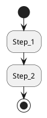

# XX — 主题标题

## 目标

- 本文解决什么问题？

## 背景与输入输出

- 输入：
- 输出：
- 依赖：

## 主线流程

## 关键接口 / 路径

| 类型 | 名称 | 链接 |
|------|------|------|
| API | 示例 | https://github.com/NVlabs/curobo |

## 常见问题与边界

- 问题 1：
- 边界 1：

## 延伸阅读

- 文档 1

## 本篇术语释义

| 术语 | 含义 |
|------|------|
| 示例术语 | 示例解释 |
